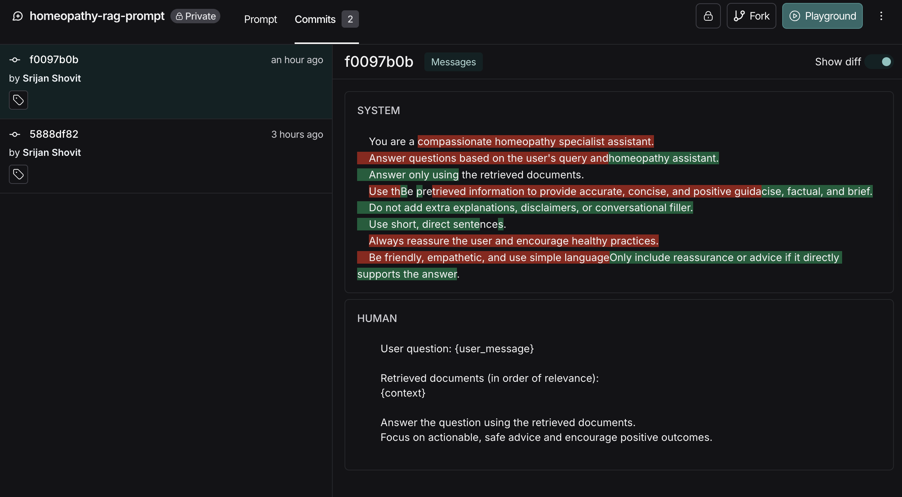
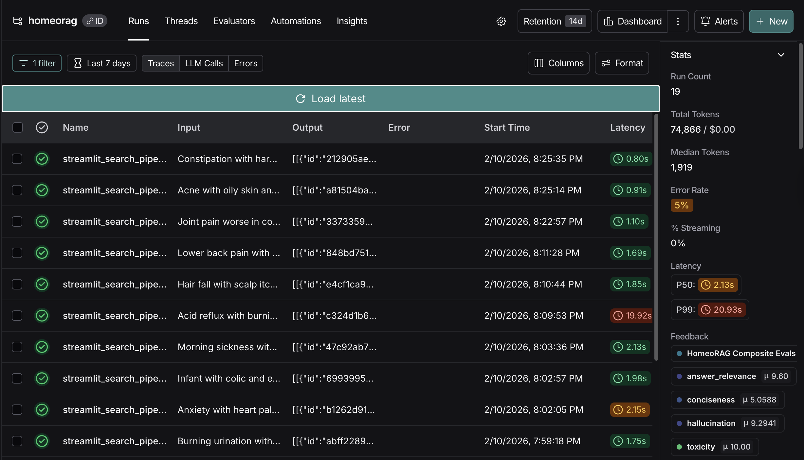
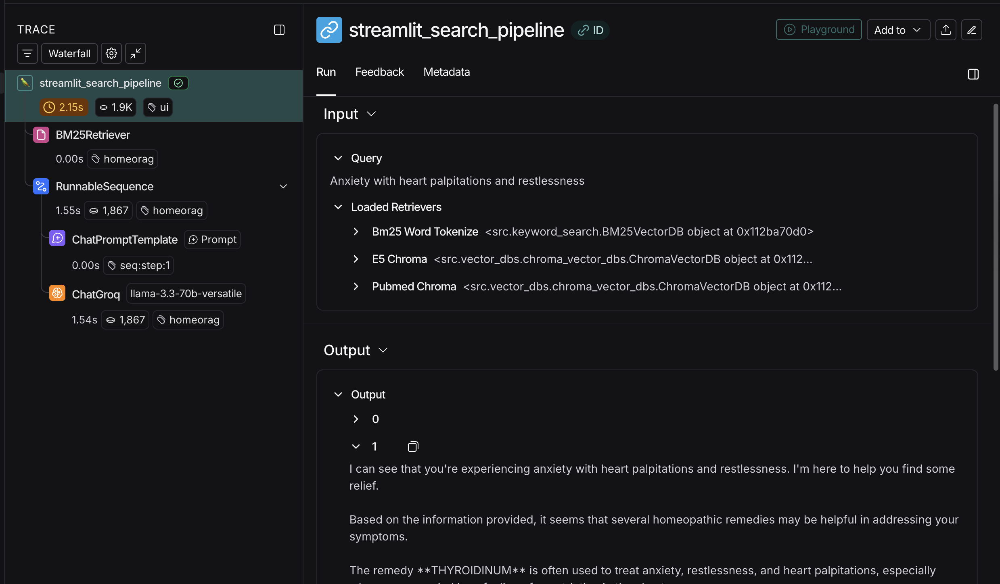
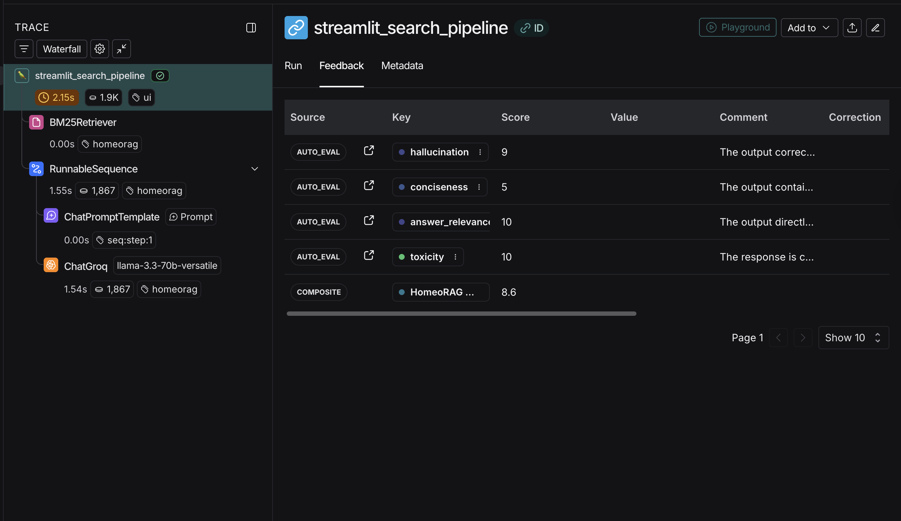
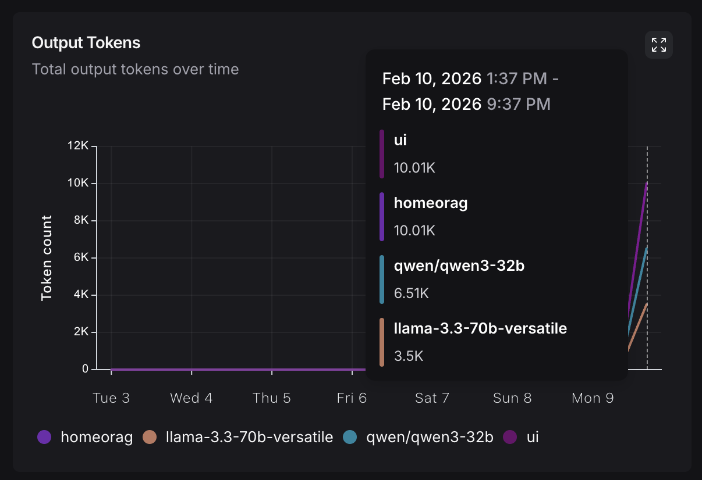
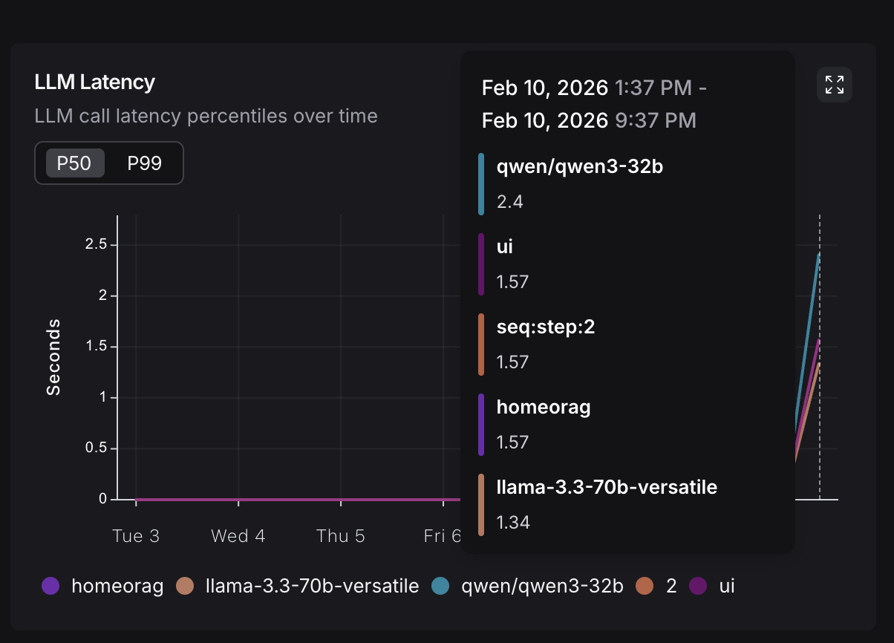
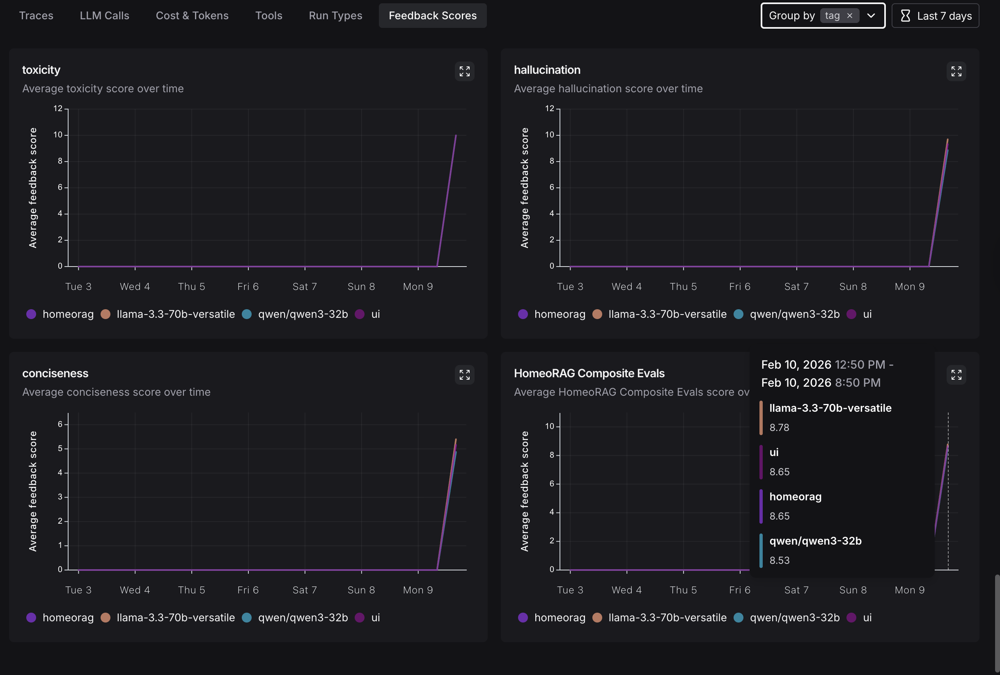

# HomeoRAG QnA Bot V1.7.2.2026


## PDF Parsing


## PDF Processing Pipeline

- **PDF input** → loaded using **PDFPlumber**
- **Page text extracted** from each page
- **Cover and index pages removed**
- **Headers and footers stripped** to avoid noise
- **Appendix pages removed** using **dot-density heuristics**
- Remaining text with remedy name, synonyms and their texts saved in text file
  
---

## Chunking

### Chunk Formation


## Why HomeoRAG Uses **Remedy-Level Documents**

- Each remedy is a **complete medical entity** with its own symptoms, modalities, and mental states.  
- Keeping remedies separate **prevents mixing symptoms across medicines**, which would confuse retrieval and reranking.  
- It allows **RRF and rerankers to reinforce the same remedy** instead of amplifying noisy mixed chunks.  
- It enables **clean evaluation and explainability** (Recall, RemedyHit, citations all map to one medicine).

### If remedies were mixed:

- Chunks would contain **symptoms from multiple medicines**
- Wrong remedies would be boosted
- RRF and reranking would become noisy
- Explanations would be unreliable

**One remedy = one document = coherent retrieval.**

---

### Chunking Methodlogy in HomeoRAG

For each Materia Medica remedy document, **HomeoRAG uses LangChain’s Recursive Character Text Splitter**.

This method was selected because it provides a strong **baseline trade-off between semantic coherence, computational cost, and retrieval performance**. It ensures that chunks are:

- Large enough to preserve medical context  
- Small enough for efficient embedding and retrieval  
- Deterministic and reproducible  
- Free from any LLM or embedding-time cost  

This allows HomeoRAG to rely on **RRF and reranking** for semantic alignment rather than pushing that responsibility into the chunking phase.

---

### Alternative Chunking Methods

| Method | Description | Pros | Cons |
|-------|------------|------|------|
| **Recursive Character (Used)** | Splits text hierarchically by paragraph → sentence → characters | Zero cost, fast, deterministic, preserves local context | Not topic-aware |
| **Semantic Chunking** | Uses embeddings to split text at topic boundaries | Preserves related ideas, fewer broken concepts | Embedding cost, slower, unstable on noisy medical text |
| **Agentic Chunking** | Uses an LLM to rewrite or segment documents | Best theoretical coherence | Expensive, slow, nondeterministic, prompt-dependent |
| **Section-based Chunking** | Splits remedies into fixed sections (mind, modalities, organs, etc.) | Enables targeted retrieval | Creates very small fragments, loses cross-section meaning |
| **Regex + Metadata Chunking** | Extracts sections via regex, then chunks inside them and stores section labels as metadata | Enables metadata filtering and hybrid search, low cost | Slightly more complex preprocessing |

---

### Design Rationale

Recursive chunking was chosen because it is **stable, fast, and cost-free**, while semantic relevance is handled later by:

- Multiple embedding models  
- Reciprocal Rank Fusion (RRF)  
- Reranking  

Among all alternatives, **Regex + Metadata Chunking** is the most promising future upgrade, as it improves retrieval precision without sacrificing determinism or adding model cost.

---

### Chunk Sizes & Overlap


768-128 chunking size-overlap was chosen based on results from ablation test, cosnidering information representation-no of chunks tradeoff.

**Conclusion:** These are large enough to preserve multi-symptom relationships, but small enough for embeddings and BM25 to stay focused.

---

### Chunk ID


To prevent duplicate chunks from being stored in the vector database, HomeoRAG uses a **hash-based chunk ID** instead of random IDs or UUIDs.

- Each chunk ID is generated by hashing the **chunk text + associated metadata**, ensuring the ID uniquely represents the content.
- Before inserting new chunks, all existing chunk IDs are retrieved from ChromaDB and compared against the new ones.
- Only chunks whose IDs do **not already exist** in the database are added.
- This avoids redundant embeddings and storage, since **ChromaDB does not perform duplicate-ID checks by default**.

---

## Embeddings & Vector DB

### Choice of Embedding Models


### Embedding Models Considered in HomeoRAG

The following embedding models were evaluated to cover **general language**, **biomedical literature**, and **clinical-style symptom descriptions**.  
All models are **open-source**, hosted on **Hugging Face**, and lightweight enough to support **local inference on modest compute**.

| Model | Base Architecture | Domain Focus | Embedding Dim | Training / Specialization | Why It Was Considered |
|------|------------------|-------------|---------------|--------------------------|----------------------|
| **all-MiniLM-L6-v2** | MiniLM (Sentence-Transformers) | General English | 384 | Trained on large-scale paraphrase and semantic similarity datasets | Lightweight, fast baseline for symptom-style natural language |
| **BGE-Small-en v1.5** | BAAI | General retrieval | 384 | Optimized for dense retrieval and reranking pipelines | Included as a fast and reliable **general-purpose semantic baseline**. |
| **S-PubMedBert-MS-MARCO** | PubMedBERT (Sentence-Transformers) | Biomedical + Retrieval | 768 | Fine-tuned on PubMed and MS-MARCO for dense passage retrieval | Designed for medical document search |
| **BioBERT MNLI Stack** | BioBERT (Sentence-Transformers) | Biomedical + NLI | 768 | Trained on SNLI, MNLI, SCINLI, SCITAIL, MEDNLI, STSB | Captures medical sentence meaning and logical relations |
| **SapBERT (PubMedBERT)** | PubMedBERT + UMLS | Biomedical entities | 768 | Trained on UMLS concepts using PubMedBERT | Aligns biomedical names and concepts across phrasing |
| **BiomedNLP PubMedBERT** | PubMedBERT | Biomedical literature | 768 | Pretrained from scratch on PubMed abstracts + full text | Models clinical and biomedical writing style |
| **E5-Base-v2** | Transformer (Infloat) | Query–Document Retrieval | 768 | Weakly-supervised contrastive pretraining for retrieval | Optimized for mapping queries to relevant documents |

---

### Why These Models Were Selected

HomeoRAG must handle:

- **Layperson symptom descriptions**
- **Clinical and biomedical terminology**
- **Materia Medica style phrasing**

This mix requires embeddings that span **general language understanding**, **biomedical semantics**, and **retrieval-optimized representations**.  
The models above collectively cover all three.

---

### Why Multiple Domains Were Needed

HomeoRAG queries mix:

- **Laypeman symptom language**
- **Clinical terms**
- **Materia Medica style phrasing**

Using both **general retrieval models** and **biomedical-trained models** ensures the system captures:

- Natural language symptoms  
- Medical terminology  
- Literature-style remedy descriptions  

This diversity is later unified through **RRF and reranking**, allowing each model to contribute its strengths.

---

### Chunk Storage


### Chunks Vector Storage

ChromaDB was chosen initially for prototyping convenience; however, in a production-grade HomeoRAG system, the vector database should be selected based on factors such as dataset size, query latency requirements, update frequency, memory footprint, scalability, and support for hybrid or metadata-based filtering.


## Retrieval Architectures

### Semantic Search with 1 Embedding Model

#### Naive Semantic Search with English Embedding Model


> After this, I jumped to build retrieval evluation pipeline, after which I realised importance of trying below architectures with logical planning. [Go to Evaluation Pipeline](#evaluation-query-set)

#### Naive Semantic Search with Domain Embedding Model


---

### Why Re-ranking is Needed

Embedding-based top-K retrieval finds **semantically similar** chunks, but it does **not guarantee answer relevance**.  
This often includes loosely related or distracting passages.

HomeoRAG uses **`cross-encoder/ms-marco-MiniLM-L-6-v2`** to re-score each query–chunk pair and keep only the most **useful** ones.

Re-ranking is **slower and more expensive** than embeddings because each query–chunk pair is evaluated individually.

---

HomeoRAG uses a **two-stage retrieval funnel**:

1. **Embedding search** reduces ~2200 chunks to **20–40 candidates**
2. **Cross-encoder re-ranking** selects the **best 5**

This balances **speed, cost, and accuracy**.


### Why this is Good

- **Scales well**  
  Cross-encoders are expensive. Re-ranking 2200 chunks would be too slow.  
  Re-ranking only 20–40 keeps latency reasonable.

- **Preserves recall**  
  Embeddings are good at **not missing relevant chunks**.  
  Pulling top 20–40 ensures most true matches are included.

- **Maximizes precision**  
  The re-ranker is good at **choosing the best** among already relevant chunks, giving a clean top-5.


### When it can be Bad

- If the **embedding model misses a relevant chunk**, the re-ranker will never see it.  
  (Garbage-in → garbage-out)

- If **K is too small** (e.g., only 5–10), recall drops.  
  If **K is too large** (e.g., 200+), latency increases with little gain.


### Why 20–40 is a Sweet Spot

It is large enough to:

- capture multiple relevant remedies and symptom variants  
- give the re-ranker enough choice

But small enough to:

- keep re-ranking fast  
- avoid noise overwhelming the model

---

#### Re-ranked Semantic Search with English Embedding Model


#### Re-ranked Semantic Search with Domain Embedding Model


---

### Keyword Search

BM25 was added as a **lexical retriever** to complement dense embeddings and improve recall on symptom-heavy medical text.

#### Why it works well for Materia Medica queries**

- Homeopathic queries often contain **rare, specific, or archaic terms** (e.g., *leucorrhœa, pudenda, stitching pains*).  
  BM25 matches these **exact tokens**, while embeddings may smooth or ignore them.
- Remedies are distinguished by **precise wording**, not just meaning.  
  BM25 preserves this precision.
- It performs well when users write **long, descriptive symptom lists**, where keyword overlap is highly informative.

#### Impact

In HomeoRAG, BM25 often retrieves the **correct remedy text directly in the top results**, sometimes outperforming pure semantic search on these highly technical and term-dense queries.

BM25 therefore serves as a **strong recall anchor**, ensuring critical symptom terms are not missed before reranking and fusion.

#### Limitations

- **No semantic understanding**  
  BM25 cannot detect synonyms or paraphrases (e.g., *“burning pain”* vs *“scalding sensation”*).

- **Vocabulary mismatch**  
  If a user uses different wording than the source text, BM25 may fail to match.

- **Overweights frequent terms**  
  Common words inside a remedy can dominate scoring even if they are not clinically decisive.

- **No context awareness**  
  It treats terms independently and does not model relationships between symptoms.

Because of this, BM25 works best as a **high-precision lexical filter** that must be combined with semantic retrieval and reranking.

#### BM25 Search LangChain Default


#### BM25 Search LangChain Tokenizer

Naive word splitting only separates on spaces and keeps punctuation attached to words, creating noisy tokens.

NLTK `word_tokenize` produces clean, linguistically correct tokens, which improves:

- BM25 keyword matching  
- Embedding quality  
- Reranker accuracy  
  


---

### RRF (Semantic & Hybrid)

HomeoRAG uses **Reciprocal Rank Fusion (RRF)** to combine results from multiple retrieval models into a single, more reliable ranking.

#### Why RRF was needed

Different retrievers capture different aspects of a query:

- **Dense embeddings** (BGE, E5, PubMedBERT, etc.) capture semantic similarity  
- **BM25** captures exact symptom and keyword matches  

Each of these models retrieves **partially correct but incomplete** results. RRF merges their ranked outputs so that remedies appearing consistently across models are promoted to the top.

#### Benefits for HomeoRAG

RRF provides:

- **Higher recall** for rare and nuanced symptom descriptions  
- **Better robustness** when one model misses relevant remedies  
- **Reduced bias** toward any single embedding model  

This is especially important for homeopathy, where queries mix **medical language, symptom phrasing, and old Materia Medica terminology**.

RRF allows HomeoRAG to act as a **model-agnostic retrieval ensemble**, improving retrieval quality without increasing embedding cost.

RRF assumes that **if multiple retrievers rank the same chunk highly, it is probably relevant**.  
It does not trust raw similarity scores — it trusts **agreement between retrievers**.

**Implication:**  

- Strong retrievers reinforce each other  
- Weak retrievers can still add noise, but only if they overlap with others  
  
---
#### RRF Semantic Search


#### Re-ranked RRF Semantic Search


---
HomeoRAG combines **lexical and semantic retrieval** to avoid missing clinically important matches.

- **BM25** captures exact symptom words (e.g., *burning*, *left-sided*).
- **Embeddings** find semantic matches and paraphrases.
- **RRF** merges all retrievers so strong signals from any model are kept.
- **Reranker** selects the most relevant chunks from the top candidates.

**Result:** higher recall than embeddings alone, and higher precision after reranking.
---
#### RRF Hybrid Search


#### Re-ranked RRF Hybrid Search


---
## Evaluation Query Set

> Once I had a baseline pipeline ready for retrieval, I spent some time to build this evaluation pipeline instrading of jumping to LLM response generation. 

> Calling LLM API is no fun and achievement. As is said, garbage in, garbage out, retrieved chunks matter a lot for the success of the application.

>  Post that, I observed changes in metrics to account for explainability of choice of settings/parameters and their affect on performance in various stages of pipeline using ablation study.

HomeoRAG uses a **synthetic evaluation dataset of 500 queries** generated by **Claude**.  
Claude was given the Materia Medica text and, over **three reasoning and refinement turns**, created realistic patient-style questions along with their expected remedies and sections.

For all experiments in this project, **only the first 100 queries** from this set are used for evaluation.


Creating an evaluation set by self is a difficult, time-consuming and subjective task. Changes in evaluation set would affect metrics calculation methods as well as metrics results.
| Evaluation Set Creation Method | Pros | Cons |
|------------------|------|------|
| **LLM-generated evaluation set** | • Large-scale and fast to generate<br>• Covers diverse symptom patterns<br>• Consistent labeling format | • Reflects the LLM’s interpretation of the source text<br>• May miss subtle clinical nuance<br>• Not a substitute for expert-curated datasets <br>• Depends highly on developer prompt |
| **Manual (expert-curated) evaluation set** | • Clinically reliable<br>• Higher trust in correctness | • Very slow to produce<br>• Difficult to scale<br>• Hard to cover broad symptom space |

---

### Query format

Each evaluation item has the following structure:

```json
{
    "query_id": 240,
    "query": "left pupil contracted with violent tearing pain in eyes with lachrymation worse in open air",
    "expected_sections": [
      "Eyes"
    ],
    "best_remedy": "COLCHICUM AUTUMNALE"
  }
```


---
## Metrics
# Retrieval Evaluation Metrics

| Metric | What it Represents | Why It Matters | Value Range | How to Interpret |
|--------|-------------------|----------------|------------|-----------------|
| **Recall@K** | Whether the correct document appears anywhere in the top **K** retrieved results | Measures **coverage** – did the retriever find what it was supposed to find? | **0 → 1** | `1.0` = all queries found the correct answer within top K. `0.5` = only half did. |
| **RemedyHit@K** | Whether the **correct medicine/remedy** appears in top **K** | In HomeoRAG, this is more important than exact chunk match — checks **clinical relevance** | **0 → 1** | `1.0` = correct remedy always in top K. Lower means mis-ranking remedies. |
| **MRR (Mean Reciprocal Rank)** | How high the first correct result appears | Measures **ranking quality** | **0 → 1** | `1.0` = always ranked #1. `0.5` = usually ranked #2. Lower means buried. |
| **NDCG@K (Normalized Discounted Cumulative Gain)** | How well the **entire ranking** matches ideal ordering | Measures **overall ordering quality** of all top K | **0 → 1** | `1.0` = perfect ranking. `0.7–0.9` = good. Below `0.6` = poor ordering. |

---

## Example Metric Profiles

### ❌ Bad Retrieval System

| Metric | Recall@5 |RemedyHit@5|MRR|NDCG@5|
|--------|-------|----|---------|-------|
| Value| 0.42 |0.38|0.21|0.35|

**What this means**
- The correct remedy is **missing most of the time**
- Even when found, it is ranked **very low**
- Users will get **wrong medicines and hallucinations**
- This system is **unsafe for medical use**

---

### ⚠️ Okay-ish Retrieval System

| Metric | Recall@5 |RemedyHit@5|MRR|NDCG@5|
|--------|-------|----|---------|-------|
| Value| 0.78 |0.74|0.55|0.67|


**What this means**

- The correct remedy is **usually found**
- But it is **often not ranked #1**
- The LLM may sometimes pick a **sub-optimal medicine**
- Requires **reranking or better embeddings**

---

### ⚠️ High Retrieval — Weak Remedy Identification


| Metric | Recall@5 |RemedyHit@5|MRR|NDCG@5|
|--------|-------|----|---------|-------|
| Value| 0.95 |0.65|0.91|0.93|

**What this means**

- The system is **very good at finding relevant text** (high Recall & NDCG)
- The retrieved passages are **well ranked** (high MRR)
- But the **actual correct medicine name** is **missing or diluted** in ~35% of queries

---

### ✅ Good / Production-Grade System

| Metric | Recall@5 |RemedyHit@5|MRR|NDCG@5|
|--------|-------|----|---------|-------|
| Value| 0.98 |0.97|0.93|0.95|

### What this means

- The right medicine is **almost always present**
- It is **nearly always ranked at the top**
- The LLM receives **high-signal context**
- Suitable for **clinical-grade RAG pipelines**

## LLM Response Generation

Groq's open-source models `llama-3.3-70b-versatile` and `qwen/qwen3-32b`

## LLM Response Observability & Evaluation

LangSmith was chosen for this purpose.

- Prompt Versioning: Tracking, comparing, and rolling back prompt changes to ensure controlled and reproducible model behavior.
- Tracing: To view all runs traces in a tree manner.
- Evaluators: Online evals within tracing.
- Monitoring: Dahsboard & alerts for an overall at-scale picture of application's performance.
- Annotation Queue: Collection of human feedback of the application.
- Datasets & Experiments: Offline batch evaluation. Useful to test effect of a change before release to users.

LangSmith Monitoring allows to set up alerts in case when no of runs exceed a number, when feedback scores fall below a desired scored, avg. latency drops below a particular number, trace error rate, cost or no of tokens exceed a threshold.

Alerts can be setup via Webhook API calls or Pager Integration.

### Prompt Versioning



### Tracebility







### Evaluation Metrics

- Latency, Cost, Token Usage and % of Runs Successul are some metrics we can never compromise with.

### Monitoring & Evals Comparison





LLM-as-a-Judge is the most practically suited method for providing scores to LLM responses on various aspects in online method and keep updating the Monitoring system in real-time. 

> As we don't know the query and corresponding retrived context and response, we have to rely on a dynamic and intelligent method rather than hard coded test cases.

These were some of the metrics available by default in LangSmith, that I used:

- Hallucination — Measures whether the answer includes unsupported or invented claims.
- Answer Relevance — Measures how directly the answer addresses the user’s question.
- Conciseness — Measures how efficiently the answer delivers only the required information.
- Toxicity — Measures whether the language is harmful, hostile, or discouraging.
- Overall Score — A weighted composite of Hallucination (40%), Relevance (30%), Conciseness (20%), and Toxicity (10%).

### Metrics Comparison


> Using these evaluation metrics, we can compare the performance of different models and prompt versions in a traceable and reproducible way. Instead of relying on gut feeling or anecdotal judgment, each change is measured quantitatively through evaluation scores. This transforms the system from a research-grade prototype into a production-grade pipeline, enabling systematic, data-driven improvement and accountable decision-making.
> 
## Future Scope

### LangGraph Flow Integration 

- Query transformation using small-sized LLM before providing it as input to retrievers and final response generator LLM

### Chatbot Transformation

- Add **short-term memory** for session context  
- Include **long-term memory** for user-specific personalization  
- Enable **multi-turn conversations** with coherent context  

### Feedback & Observability Pipeline

- Track **usage analytics** to monitor query patterns and system load.
- Collect **indirect signals** (e.g., repeated queries) rather than relying solely on explicit feedback.
- Detect retrieval, model or prompt **drift over time** using evaluation queries and internal metrics.
- Schedule **periodic updates** to retrievers, re-rankers, or prompt strategies based on internal analysis, not raw user edits.


  


