# HomeoRAG QnA Bot V1.7.2.2026

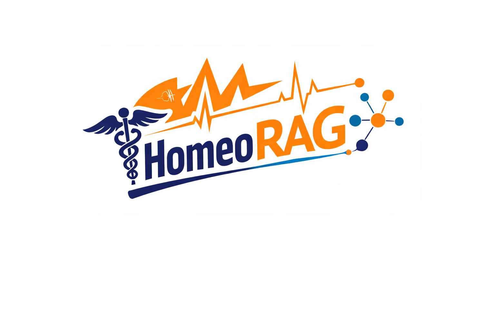

## PDF Parsing
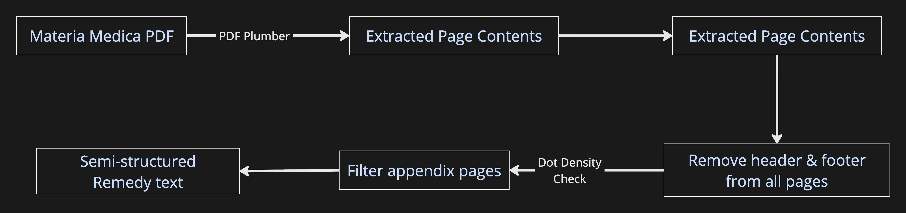

## Chunking
### Chunk Formation
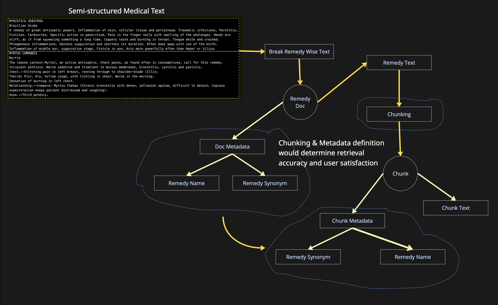

### Chunk Strategies
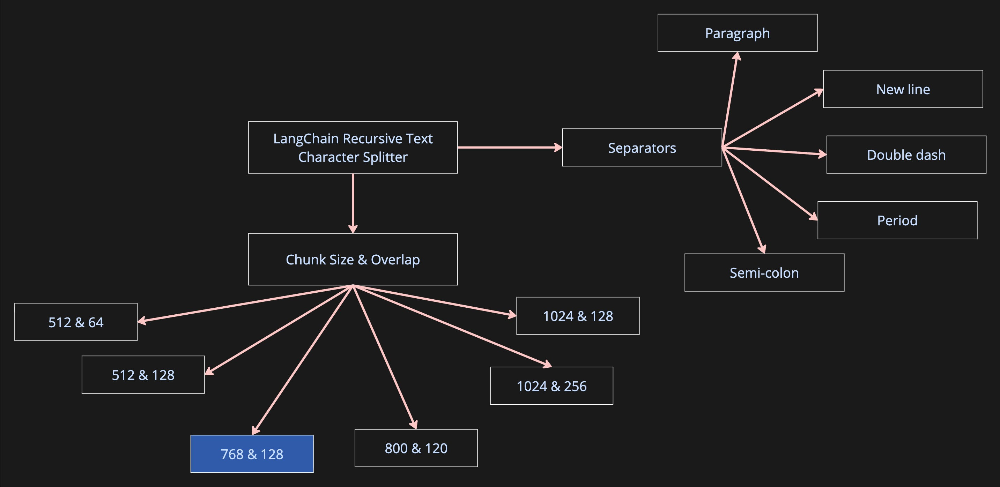

### Chunk ID
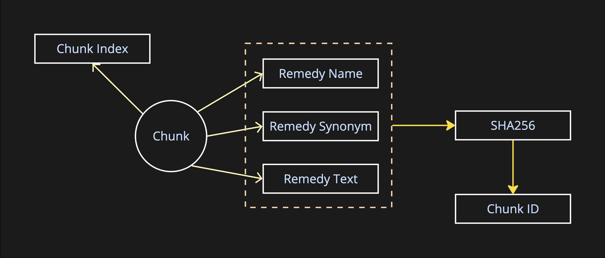

## Embeddings & Vector DB
### Choice of Embedding Models
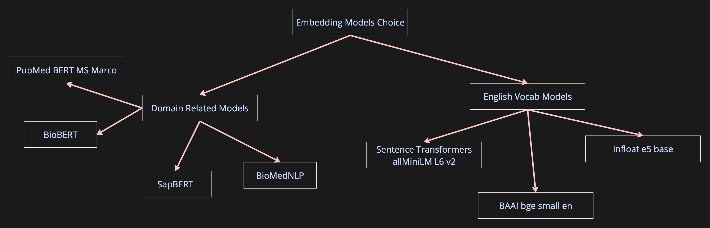

### Chunk Storage
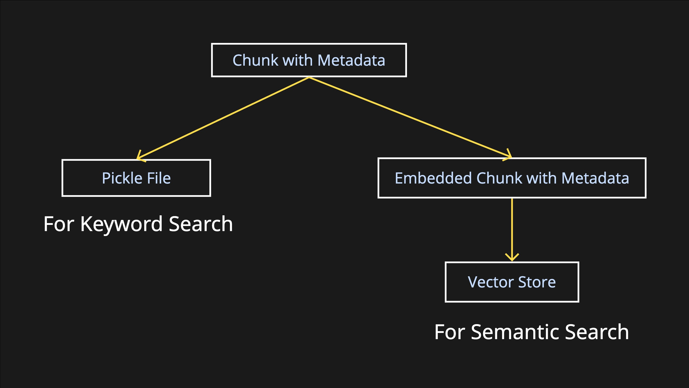

### Chunks Vector Storage
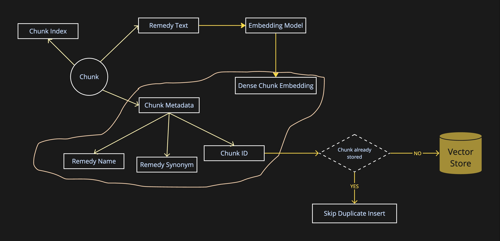

## Retrieval Architectures
### Semantic Search with 1 Embedding Model
#### Naive Semantic Search with English Embedding Model
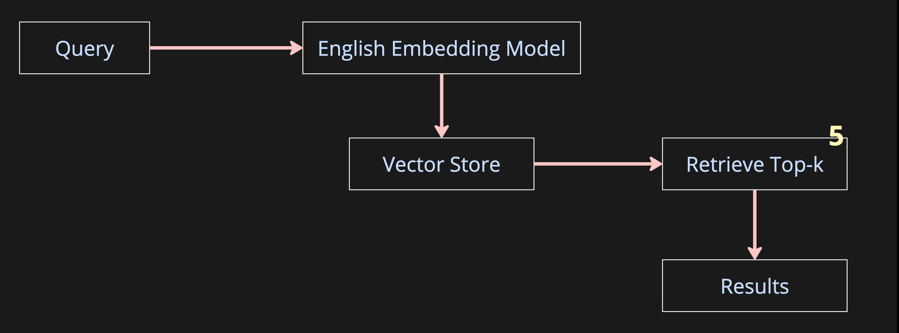

#### Naive Semantic Search with Domain Embedding Model
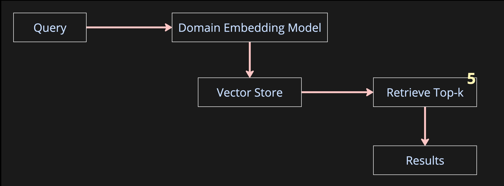

#### Re-ranked Semantic Search with English Embedding Model
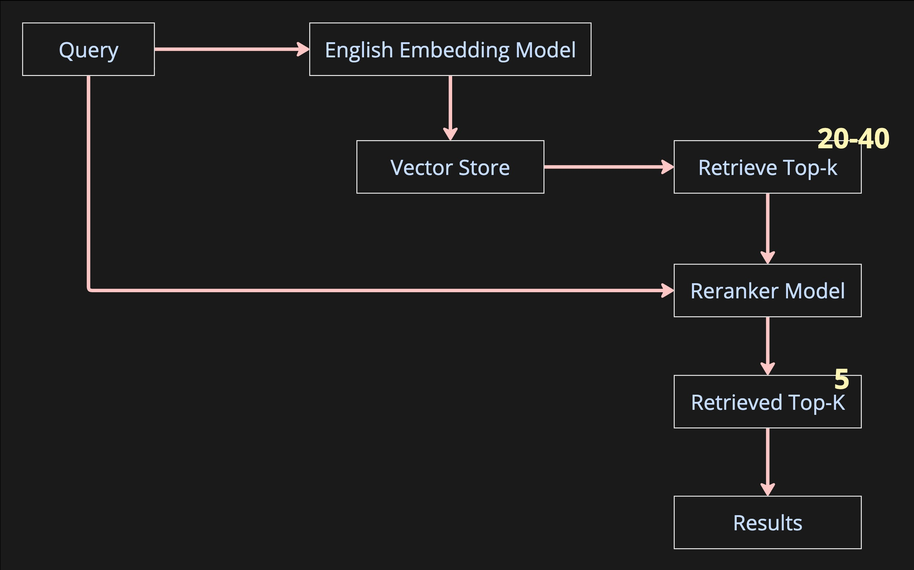

#### Re-ranked Semantic Search with Domain Embedding Model
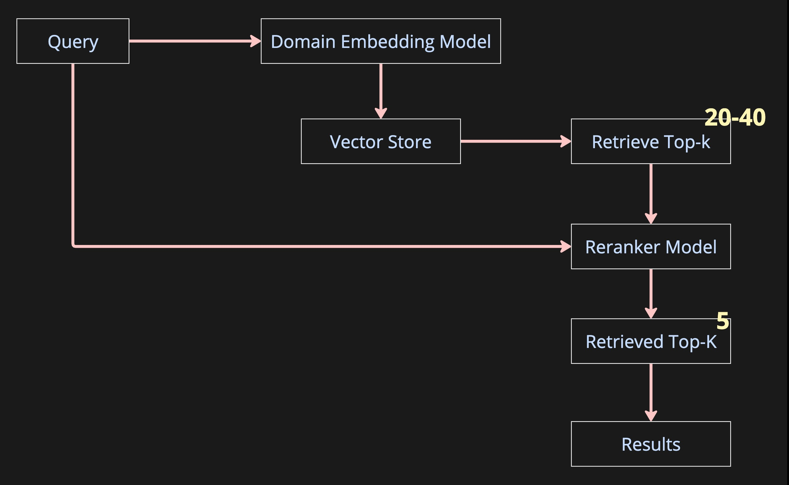

### Keyword Search
#### BM25 Search LangChain Default
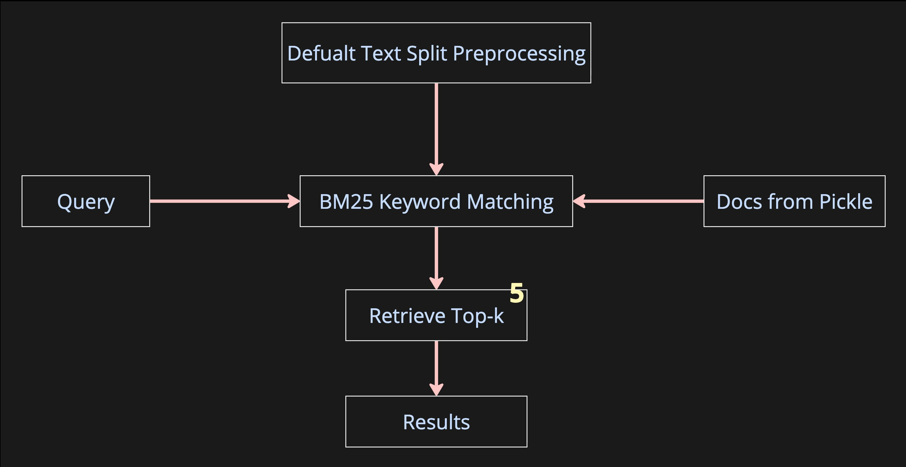

#### BM25 Search LangChain Tokenizer
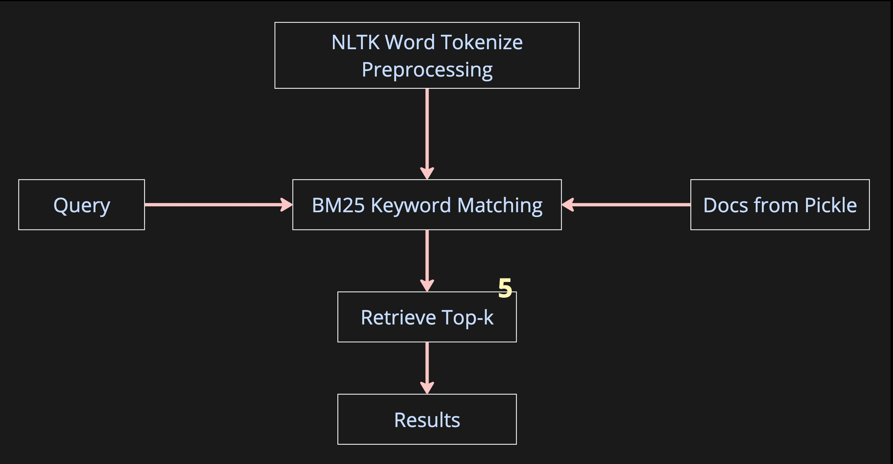

### RRF (Semantic & Hybrid)
#### RRF Semantic Search
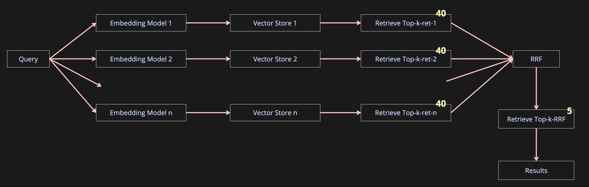

#### Re-ranked RRF Semantic Search
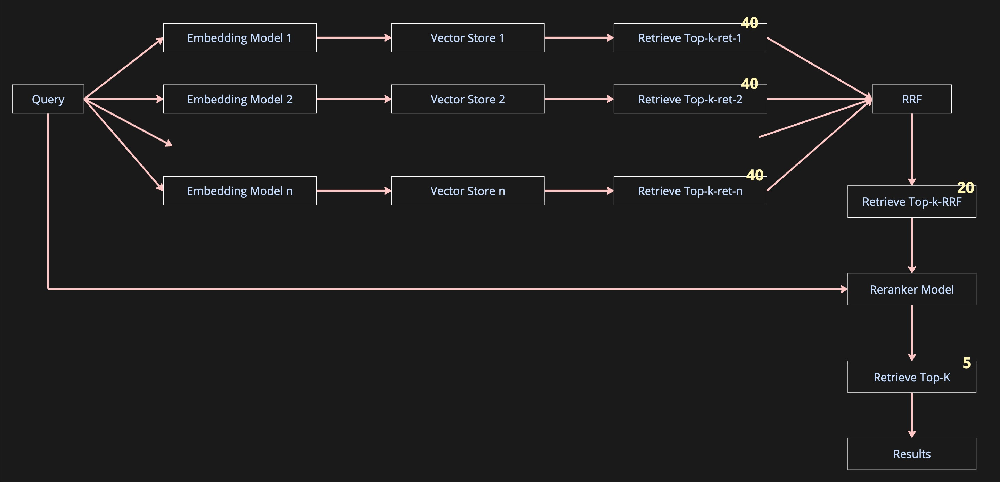

#### RRF Hybrid Search

#### Re-ranked RRF Hybrid Search
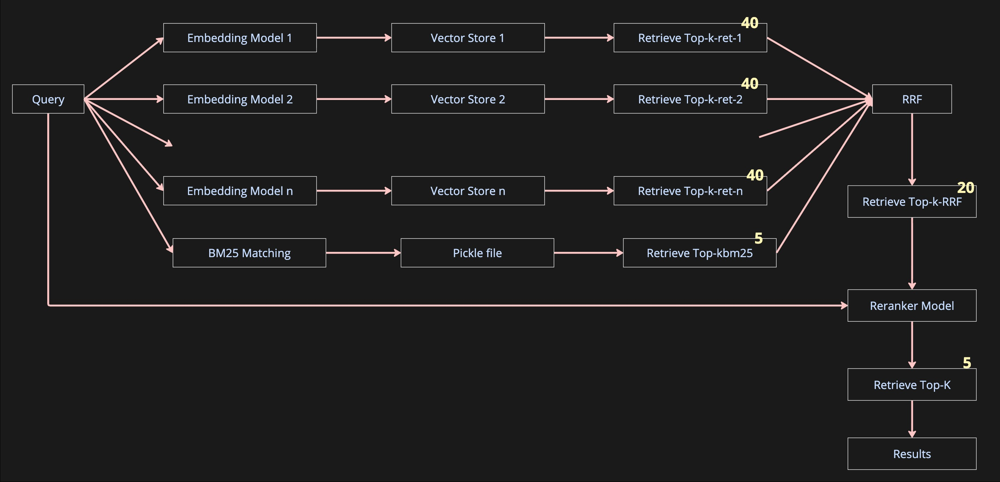

## Metrics
# Retrieval Evaluation Metrics

| Metric | What it Represents | Why It Matters | Value Range | How to Interpret |
|--------|-------------------|----------------|------------|-----------------|
| **Recall@K** | Whether the correct document appears anywhere in the top **K** retrieved results | Measures **coverage** – did the retriever find what it was supposed to find? | **0 → 1** | `1.0` = all queries found the correct answer within top K. `0.5` = only half did. |
| **RemedyHit@K** | Whether the **correct medicine/remedy** appears in top **K** | In HomeoRAG, this is more important than exact chunk match — checks **clinical relevance** | **0 → 1** | `1.0` = correct remedy always in top K. Lower means mis-ranking remedies. |
| **MRR (Mean Reciprocal Rank)** | How high the first correct result appears | Measures **ranking quality** | **0 → 1** | `1.0` = always ranked #1. `0.5` = usually ranked #2. Lower means buried. |
| **NDCG@K** | How well the **entire ranking** matches ideal ordering | Measures **overall ordering quality** of all top K | **0 → 1** | `1.0` = perfect ranking. `0.7–0.9` = good. Below `0.6` = poor ordering. |

---

## Example Metric Profiles

### ❌ Bad Retrieval System

| Metric | Recall@5 |RemedyHit@5|MRR|NDCG@5|
|--------|-------|----|---------|-------|
| Value| 0.42 |0.38|0.21|0.35|

**What this means**
- The correct remedy is **missing most of the time**
- Even when found, it is ranked **very low**
- Users will get **wrong medicines and hallucinations**
- This system is **unsafe for medical use**

---

### ⚠️ Okay-ish Retrieval System

| Metric | Recall@5 |RemedyHit@5|MRR|NDCG@5|
|--------|-------|----|---------|-------|
| Value| 0.78 |0.74|0.55|0.67|

**What this means**
- The correct remedy is **usually found**
- But it is **often not ranked #1**
- The LLM may sometimes pick a **sub-optimal medicine**
- Requires **reranking or better embeddings**

---
### ⚠️ High Retrieval — Weak Remedy Identification

| Metric | Recall@5 |RemedyHit@5|MRR|NDCG@5|
|--------|-------|----|---------|-------|
| Value| 0.95 |0.65|0.91|0.93|

**What this means**

- The system is **very good at finding relevant text** (high Recall & NDCG)
- The retrieved passages are **well ranked** (high MRR)
- But the **actual correct medicine name** is **missing or diluted** in ~35% of queries

---

### ✅ Good / Production-Grade System

| Metric | Recall@5 |RemedyHit@5|MRR|NDCG@5|
|--------|-------|----|---------|-------|
| Value| 0.98 |0.97|0.93|0.95|

**What this means**
- The right medicine is **almost always present**
- It is **nearly always ranked at the top**
- The LLM receives **high-signal context**
- Suitable for **clinical-grade RAG pipelines**

